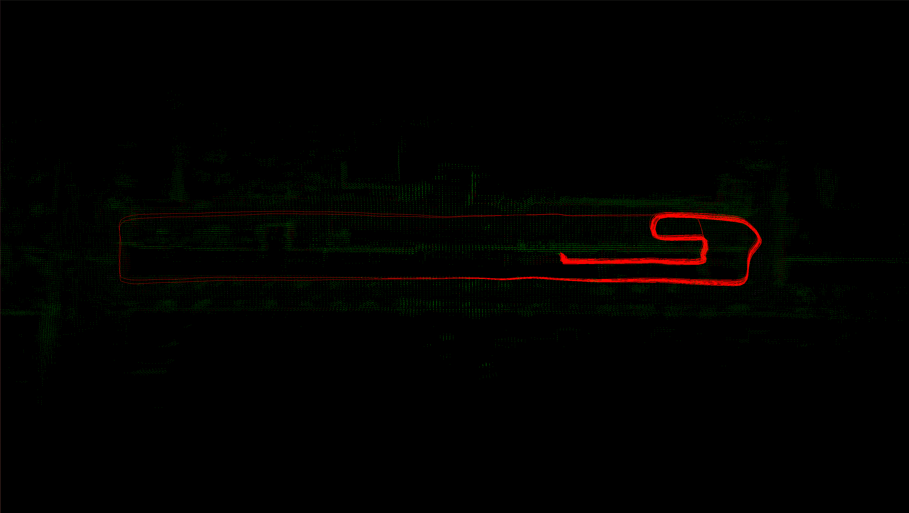
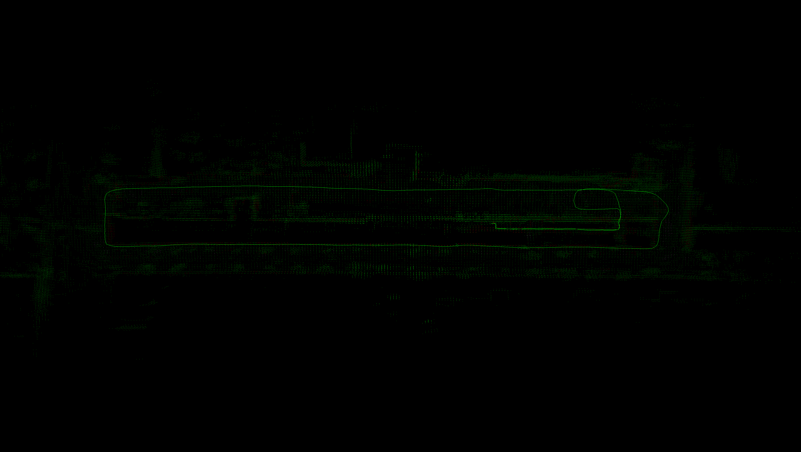

# GPU Computing in Robotics

This tutorial concenrs 3D lidar data processing with CUDA
Content of the tutorial:

## Lessons

### Lesson 0: basic transformations

### Lesson 1: down-sampling

### Lesson 2: noise removal (naive)

### Lesson 3: nearest neighborhood search

### Lesson 4: noise removal

### Lesson 5: normal vector computation

### Lesson 6: projections

### Lesson 7: basic semantics

### Lesson 8: semantic nearest neighborhood search

### Lesson 9: data registration Iterative Closest Point

### Lesson 10: data registration semantic Iterative Closest Point

### Lesson 11: data registration point to projection Iterative Closest Point

# Requirements

Software was developed and tested on LINUX UBUNTU 14.04 with following libraries
OpenGL, GLUT, PCL 1.5, CUDA>=7.5

remark: there is a problem with NVCC on UBUNTU 16.04, CUDA 8.0 (work in progress)

# Build
Each lesson is an independent software package, thus the following steps should be performed:
```
cd lesson_X
mkdir BUILD
cd BUILD
cmake -DCMAKE_BUILD_TYPE=Release ..
make
./lesson_X
```
## Use Cases

### fastSLAM
This DEMO shows the parallel computing for fastSLAM. Each particle containes 3D map built based on registered Velodyne VLP16 3D semantic data. The result is corrected trajectory.

#### Execute

Run `./fastSLAM` and read instructions in console

to run example
```
./fastSLAM ../dataset/model_reduced_pointXYZIRNL.xml
```

**Results**

Here are results achieved using example above.







